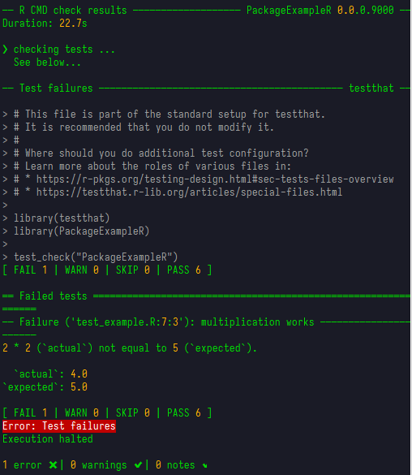

```{r, include = FALSE}
knitr::opts_chunk$set(
  collapse = TRUE,
  comment = "#>"
)
```

# Git intro

## Cloning the repository

To get started with Git, you need your operating system to recognize Git commands.
We will assume you are on Windows, so you will have to install Git from
[here](https://git-scm.com/downloads/win). If you do not know whether it is the 32
or 64 bits version, you most likely need the 64 bit one. You should now have
something called 'Git Bash' installed, which is like a command line tool
(similar to Windows CMD). You can open Git Bash inside a specific directory
(this is just a technical name for folders and I will use it from now on)
by right-clicking your desired directory in the file explorer and selecting
'Open Git Bash here'. However, I would recommend you to learn some basic commands
to navigate from the command line itself (from now on, __writing `<some-text>` is
not part of the command__, I just use it as a __placeholder__ for what you need
to write there):

- Print your current directory:
  ```
  pwd
  ```
  This is just useful so you can see where you are right now.
- List files from your current directory:
  ```
  ls
  ```
  Suppose you do not know the exact path to follow but you know it is inside a
  certain subdirectory from the one you are in right now. Listing everything in
  the current directory with `ls` is a useful way to spot which subdirectory
  you are looking for, so that you can then navigate inside it with `cd`.
- Move to another directory relative to the one you are in right now:
  ```
  cd <relative-path-where-to-move>
  ```

You can use `ls` and `cd <relative-path>` repeatedly until you are in the
directory where you want to place a subdirectory containing the repository.
Again, you can double check that using `pwd`.

We assume here that the repository you want to contribute to already exists.
You can go to its page on Github and copy the URL as seen in the image below:

```{r, fig.alt="Where to copy URL from", echo=FALSE}
knitr::include_graphics("imgs/copy_repo_url.png")
```

The git terminology used for 'downloading' a repository to our local file system
is 'cloning'. We can clone a remote repository (in this case from Github)
using the following command:
```
git clone <url-you-copied>
```

This is called cloning via HTTPS. A browser should open and ask you to introduce
your Github credentials. There are other ways of cloning like SSH, but that is
out of the scope of this guide.

## Pulling remote changes

Now a new directory should have been created with the content of the repository
in your local file system. From now on we will see the basic git commands that
you would need in daily usage. We assume you are inside the repository. We
explain them with an example.

Suppose you want to start contributing to this repository. A good practice
(and one that we will enforce to use) is to make your own code changes in a
'different place' than the ones you currently see in the repository. The things
you see now are in what it is called the 'main branch', and you will make your
code changes in a 'new branch', which will start with the same content as the
main one, but will then evolve with different changes. If you have not done
anything yet, you should be in the main branch (maybe it is called 'main' or
'master', these are just conventions, but I will assume it is called 'main').
You can use the command `git status` to check this (do not mind that my terminal
looks different in the screenshots, you can use the same commands in Git Bash):

```{r, fig.alt="Using git status", echo=FALSE}
knitr::include_graphics("imgs/git_status_command.png")
```

Your local version of a repository does not need to match the remote version
(the one we store in Github in this case), but before you start your work on
a new branch, you should keep your main branch up to date in case someone
added new code in the Github repository since the last time you checked. We
get any new remote changes to the local repository by using the command
```
git pull
```

```{r, fig.alt="Using git pull outputs 'Already up to date'", echo=FALSE}
knitr::include_graphics("imgs/git_pull_command.png")
```

In this case I already had all the remote changes, and that is why the message
says 'Already up to date', but the message will be different if you had missing
changes. This is the 'easy way' to do it. The command `git pull` tries to
fetch changes from the equivalent remote branch, i.e., the one that has the same
name on remote as it has on your local repository. This may not always work as
expected so there is a way to always specify from which remote branch you
want to get these changes (and I highly recommend always using it explicitly):
```
git pull origin <name-of-remote-branch>
```
For example, imagine you asked someone for help on your own branch and they
added some new changes on your branch, that you do not have locally. Then,
if your branch is called `my-branch`, and you are already on your branch
locally, you would want to use the command
```
git pull origin my-branch
```
Likewise, for the first example shown here (keeping the main branch updated),
I would always be explicit:
```
git pull origin main
```

## Creating our own branch

After the pull, we are now safely up to date with the remote changes. Now it is
time to learn how to create our own 'branch', from which we will start working
on new code. We use the following command:
```
git checkout -b <name-of-branch>
```

```{r, fig.alt="Using branch creation command", echo=FALSE}
knitr::include_graphics("imgs/branch_creation_command.png")
```

The command `git checkout <name-of-branch>` is used to change from one branch
to another (so that you will now see the files and changes that are in that
branch). Additionally, if we add the `-b` option, it will create the branch with
the given name if it does not already exist, which is our case in this example.
The branch name should be something like `author/name-of-branch`. Thus, some
common practices for naming your branches (and that we should follow) are:

- They do not contain caps (all lowercase)
- Words are separated with dashes (`-`)
- The name includes the author and some descriptive name separated by a slash (`/`)
- The descriptive name should ideally start with an action (a verb) in imperative
style (fix, create, test...).

If Ermenegildo wants to create some code for preprocessing bilateral trade data,
an acceptable branch name could be `ermenegildo/preprocess-bilateral-trade-data`.

## Adding changes to our branch

Now you are in your own branch and you can start working on your changes. While
you work on them, you should keep track of changes with git. We can add all
changes using the command
```
git add .
```
Here the dot means 'this directory', which essentially adds all new changes, i.e.
all things inside the directory. We can add just a specific file instead using
the command
```
git add <relative-name-of-file>
```

```{r, fig.alt="Add all git changes", echo=FALSE}
knitr::include_graphics("imgs/add_all_git_changes.png")
```

After adding our changes, we must 'commit' them. This commit step is what actually
saves your changes in the git history. You do this with the command
```
git commit -m 'Some descriptive message for your changes'
```
A common practice for commit messages is to start them with a verb in infinitive
(imperative style), indicating an action that was performed, e.g.,
`'Create tests for bilateral trade data preprocessing'`.

```{r, fig.alt="Commit the changes", echo=FALSE}
knitr::include_graphics("imgs/commit_changes.png")
```

A common practice is to make small commits, that is, include just a few changes
in each commit, so that it is easier to keep track of your work's history, instead
of just having a single commit when you are done with everything. Ultimately, the
amount of commits is your decision, but should not be just one commit per branch.

## Pushing our changes

After committing, we now have our changes in local git history, but we should
probably also add them to the remote Github repository. We do this using the command
```
git push origin <name-of-branch>
```
Now you should be able to see your changes in your own branch from Github itself,
you just need to select your own branch instead of the `main` one.

You should remember to push your changes regularly to the remote repository.
Otherwise you risk having a bunch of code features in your local computer that
could be lost if something happened to it. This is aligned with the previous
suggestion of creating many smaller commits as opposed to giant ones, so that
you can also push them more frequently.

## Creating a pull request

Suppose you are done with your changes and you want to add these to the main
branch. Mixing one branch with another is known as 'merging'. In this case we would
like to merge our new branch with the main branch. This can be done forcefully, but
the common practice we will be following is to create what is known as a 'Pull
request' from our branch into the main one, and we do this directly from Github,
once we have pushed all of our changes.

```{r, fig.alt="Click 'New pull request' in Github", echo=FALSE}
knitr::include_graphics("imgs/new_pull_request.png")
```

```{r, fig.alt="Click 'Create pull request'", echo=FALSE}
knitr::include_graphics("imgs/create_pull_request.png")
```

Here you can see all the changes you made (that differ from the main branch) before
clicking again 'Create pull request'. Then you will see the following, where you
should add some title and description to explain what you have done. You finally
click 'Create pull request' again.

```{r, fig.alt="Add title and description and click 'Create pull request'", echo=FALSE}
knitr::include_graphics("imgs/add_pr_title_description.png")
```

Now the Pull Request (often abbreviated as PR) is created and the next step is to
ask for someone's review.

```{r, fig.alt="Adding people to review your PR", echo=FALSE}
knitr::include_graphics("imgs/add_people_review_pr.png")
```

Ideally these changes would not be merged until someone else reviews your code.
This person might find things you have to change and request these changes before
merging, so you would have to keep working on your branch until they are satisfied.
Then they would accept your changes and you would be ready to merge your branch
into the main one, and the process would be done.

However, sometimes there is
an additional step that must be passed before merging, which is related to
automatic code checks, e.g. check whether your code is well formatted and
whether it passes all tests successfully. If configured, these can run
automatically when creating a Pull Request. We will indeed work with them, but we
will explain these automatic checks better in the
[Automatic checks on Pull Requests section](#automatic-checks-on-pull-requests).

While working on your own branch, others may have merged their own branches
into the main branch and then your own branch would be outdated. When creating
a Pull Request yourself, you should make sure your branch is also up to date with
everything already on the main branch. Recall from
[the pulling remote changes section](#pulling-remote-changes) that we can do this
with the command
```
git pull origin main
```
Even if you are locally on your own branch and directly try to fetch changes from
a different remote one (in this case `main`), this works as expected, that is,
it tries to merge all new changes from the `main` branch into your own local one.
This automatic merge works most of the times, but sometimes you may find conflicts,
because the program does not know how to combine everything neatly. If this happens,
you must manually check which parts of the code should be kept. In the next section
we explain how to solve conflicts.

## Solving conflicts

As noted in the previous section, sometimes when you `git pull` from another
branch or from the same remote one (if you are missing some changes), you can
find conflicts. A conflict looks like this:

```
<<<<<<< HEAD
this is my content
that I just added
=======
this is some different conflicting content 
from the branch I pulled from
>>>>>>> some_branch_name
```

So in a conflict, there are at least three lines the were added by git to
separate the conflicting parts. The conflict starts at the line `<<<<<<< HEAD`,
and until we get to the `=======` line, the lines in between are the content
_we_ added. Then from this one until the end `>>>>>>> some_branch_name`, the
lines in between are the content that _someone else_ added and we did not
have yet. Then solving a conflict essentially means removing these three lines
added by git. We have three options here. You will have to decide which one
you want depending on the situation:

- Keep only our content. Solving the conflict would involve removing all lines
  except:
  ```
  this is my content
  that I just added
  ```
- Keep only the other content. We remove everything except:
  ```
  this is some different conflicting content 
  from the branch I pulled from
  ```
- Keep some (or all) content from both parts, or even adapt it adding other
  things. We remove the three lines added by git and everything else we do
  not want to keep, leaving something like a mix:
  ```
  this is my content
  that I just added
  this is some different conflicting content 
  ```

If you have to find conflicts (I advise to do it manually), you could use
some text finding tool in your editor, and look for the text `HEAD`, as this
always appears in the first line of a conflict. After you solved all
conflicts, you have to do the rest of the steps explained in previous
sections, involving `git add` and `git commit`, because a pull also counts
as a code change, so you have to make a commit from it. In case you are
wondering, when you perform a pull without conflicts, you are not creating
a commit yourself but git does it for you, automatically. So whether you
solved the conflicts or git did it for you, there will always be a commit
representing it.

# R package and renv intro

## Project structure

It seems clear that even though we would work fine with bare R scripts that are run
directly, when working on a large project it makes sense to have some kind of
file structure, to keep everything organised. You can build your ad-hoc file
structures, and you could probably come up with something rather simple. Here,
instead, we will focus on using the standard structure of an R package. This
is a standard everyone has to follow if they want their projects to turn into
packages which can be publicly downloaded by anyone from the
[CRAN repositories](https://cran.r-project.org/). Just the same way you do, e.g.,
`install.packages(tidyverse)` to install all Tidyverse packages, if you
follow this standard R package structure, you can upload your package and one could do
`install.packages(your_package)` the same way.

Even if you do not want to upload a package, there are still advantages if you
follow this structure. This is the one we will follow, so the rest of this section
will try to explain its different parts, that will all become part of our workflow.

This is the whole structure of an R package:

```{r, fig.alt="Structure of an R package", echo=FALSE}
knitr::include_graphics("imgs/r_package_structure.png")
```

Luckily, there are a lot of files there that you do not need to know about,
at least for now, so we will try to explain the most important ones in the
next sections.

There is a whole [R packages book](https://r-pkgs.org/) which
I followed myself to setup the basics for our project. It is very well
written and available for free online, so if you are interested in knowing
more about R packages and their project structure, I recommend checking the
book.

## Virtual environments with renv

We just mentioned we were going to use the R package structure, and it seems
R package developers do not use `renv`... Or do they? At least they do not seem
to include `renv` related files in their package repositories... Well, why
should _we_ use it then? While writing this guide I was a bit confused myself
about mixing both things, but my conclusion was that it just does not hurt
in any way, `renv` just makes things easier without apparent drawbacks
(do tell me if you know of any). When creating packages, you want to make sure
they work on fresh installations, i.e., computers that do not have anything
unnecessary installed. The package creation process as we will use it, does
not need to know anything about `renv`, so we should be fine. The packages use
their own file called `DESCRIPTION` which includes information about the
other packages it needs as dependencies, as we will see later on. So we can
just try to benefit from using virtual environments.

OK, but what are virtual environments? This is a fancy term, but its practical
meaning is quite simple. First consider the following:

- If you are not using them, it means you just have a global R installation
in your computer, and whenever you install a package, it is installed globally.
- If you want to run someone's code and they use a bunch of packages
that you usually do not, you would have to install all of them to be able
to run their code, and these would mix with all your other packages. If
you want to uninstall them after that, you would have to do a lot of manual
work to make sure you know all of them (some package dependencies could have
also been installed, and you cannot be sure if they were only used for these
packages or also some other package that you already had).
- If you want to write some code that uses some packages, and you want
another person to run it, you should make a list of the packages used only
in this project, because they should not have to install any other packages
you have from other projects but are not necessary here. If you do not
even make this 'package list', the other person should have to go through
your whole code or run it and install a new package every time the code
fails because of a missing one. Overall, this is a poor experience.

Virtual environments try to fix this. Essentially, they provide a 'local'
installation of packages, that are only visible inside your project, and
do not get mixed at all with those from your global R installation or from
other individual projects. In practice, a virtual environment is just a
folder containing installed packages, isolated from the folder that
contains your global R installation. It is like having several different
R installations, each one with their own packages and versions.

Chances are you follow this guide with an existing repository that is
already using `renv` (then you can skip the `renv::init()` step). If this
were not the case, open an R prompt in the root directory of your project
and run inside the prompt:
```
renv::init()
```
It will probably ask to close and reopen a clean prompt. After that, every
time we open an R prompt inside our project, it will automatically use `renv`
to work within a virtual environment. If you use `renv` for the first time
but on a project that already uses it, when you open the R prompt in its
root directory, the `renv` package will be installed automatically.

Now that we have `renv`, we can, for example, install a testing package
with `install.packages("testthat")` and this will not be a global
installation, which means it will only work inside this project. This is
a way of isolating your project dependencies and making your projects
reproducible, by letting others know exactly which packages your code
needs to run, and not add unnecessary ones that you may have because
of other projects, as we mentioned previously.

The 'list' of required packages for the project, along with their versions,
which is used by `renv` to manage the virtual environment, is in a file
called `renv.lock`. After installing new packages, this file is not updated
automatically and we have to do it manually by running
```
renv::snapshot()
```
This will update the `renv.lock` file with all the packages `renv` finds
are used in your code. If for some reason you need to install a package not
explicitly used in the code, this may fail to recognize it. In that case, you
should instead explicitly call `renv::snapshot(type="all")` to force every
package in your `renv` environment to be added to `renv.lock`. You should push
this file to the repository. If someone else wants to reproduce your code, then
they may have to run
```
renv::restore()
```
which will install any packages from `renv.lock` that they may still not
have installed, but again, only on a project level, not conflicting with
their global R installation. If you use Github with others, then you might
also need to do this every time you pull remote changes and someone else
has included a new package, so that you are then up to date with them.
In any case, when opening the R shell, it will probably remind you that there
are missing packages in your virtual environment with a message:

```{r, fig.alt="renv warns packages not installed", echo=FALSE}
knitr::include_graphics("imgs/renv_warn_packages_not_installed.png")
```

And this is basically all you need to start using a virtual environment,
keeping in mind the commands

- `renv::snapshot()`: add new required packages to `renv.lock` file
- `renv::restore()`: install packages from `renv.lock` that you do not have yet

I wrote this introduction to `renv` by reading their own package documentation.
If you want to learn more about it, you can read it yourself at
[their package website](https://rstudio.github.io/renv/articles/renv.html).

While this is not directly related to `renv` usage, I wanted to highlight
here that in Windows you may have errors trying to install some R packages.
Most of the times this may be related to missing operating system dependencies
or commands. In Windows this should be easily fixable by installing the version
of [Rtools](https://cran.r-project.org/bin/windows/Rtools/) that matches with
your R version. After selecting the version you can download it by clicking
the first installer link. After installing Rtools, you can try again to
install the R packages you wanted.

## Writing code

Looking back at the package's file structure, it is in the `R/` directory
where we will put all the main code. The R files stored here must not
contain any top-level code, that is, it must all be inside functions.
We can add more than one function in each file if they are somehow related,
but there must not be too many either. If a file becomes too large and it
has several functions inside, consider splitting it into shorter files.

Take the following code as an example, written by our colleague Justin (you do not
have to understand the code, you can keep reading). We save it in `R/sources.R`.
```r
#' Create a new dataframe where each row has a year range into one where each
#' row is a single year, effectively 'expanding' the whole year range
#'
#' @param trade_sources A tibble dataframe
#' where each row contains the year range
#'
#' @return A tibble dataframe where each row
#' corresponds to a single year for a given source
#'
#' @export
#'
#' @examples
#' trade_sources <- tibble::tibble(
#'   Name = c("a", "b", "c"),
#'   Trade = c("t1", "t2", "t3"),
#'   Info_Format = c("year", "partial_series", "year"),
#'   Timeline_Start = c(1, 1, 2),
#'   Timeline_End = c(3, 4, 5),
#'   Timeline_Freq = c(1, 1, 2),
#'   `Imp/Exp` = "Imp",
#'   SACO_link = NA,
#' )
#' expand_trade_sources(trade_sources)
expand_trade_sources <- function(trade_sources) {
  non_na_cols <- c("Trade", "Timeline_Start", "Timeline_End", "Timeline_Freq")
  trade_sources |>
    dplyr::filter(!.any_na_col(non_na_cols)) |>
    .expand_trade_years() |>
    dplyr::mutate(
      Name = dplyr::if_else(
        Info_Format == "year", paste(Name, Year, sep = "_"), Name
      ),
      ImpExp = `Imp/Exp`,
      In_Saco = as.integer(!is.na(SACO_link)),
    )
}

.expand_trade_years <- function(trade_sources) {
  trade_sources <- dplyr::mutate(trade_sources, No = dplyr::row_number())

  trade_sources |>
    dplyr::group_by(No) |>
    tidyr::expand(Year = seq(Timeline_Start, Timeline_End, Timeline_Freq)) |>
    dplyr::inner_join(trade_sources, by = "No")
}

.any_na_col <- function(cols_to_check) {
  dplyr::if_any(dplyr::all_of(cols_to_check), is.na)
}
```

In this sample code there are some things to keep in mind:

- All the code is written inside functions, and there are three of them. The
name of two of them starts with a dot. This is a convention for private functions.
Private functions are just helpers that are used in other functions from the
same file, they do not need to be used from outside.
- The functions that are not private, are then called public, and those are the ones
that we want to 'export', in the sense that we want to allow for them to be used
from outside this file. In our `sources.R` example, the first function is public.
- The public function has a large commented section before it, each line starting
with `#' `. This is a special type of comment and it is considered documentation.
Every public function __must__ be documented in the same way (more on this special
function documentation in the next section). The private functions can be
introduced by explanatory comments if you consider it necessary, but they should
be normal comments instead (starting with just `# `, without the single quote).

The most important take from here anyway is that these files should contain all
the code inside functions and nothing outside them.

## Function documentation

The special commented section seen in the previous example will be used by a
package called [`roxygen2`](https://roxygen2.r-lib.org/). We have to follow
this exact syntax, so that this package can automatically build a really neat
documentation of our package for us. Let's try to understand its basic
structure. For reference, these were the different parts:

- A small description of the function, nothing else.
```
#' Create a new dataframe where each row has a year range into one where each
#' row is a single year, effectively 'expanding' the whole year range
```

- A small description of each parameter the function receives. It should be like:
```
#' @param param_name_1 Description of param 1
#' @param param_name_2 Description of param 2
#' ...
```
As you see here I think it is OK to add linebreaks in between, as long as each
parameter starts with `@param`.
```
#' @param trade_sources A tibble dataframe
#' where each row contains the year range
```
- A small description of the value the function returns. It should start with
`@return`.
```r
#' @return A tibble dataframe where each row
#' corresponds to a single year for a given source
```
- A simple line containing `@export` to indicate the function can be used in
the package, i.e., it is public.
```r
#' @export
```

- A 'code' section of examples to illustrate the function's behaviour.
It must start with `@examples`, and after that you can write usual R code.
When this is processed, it automatically runs the code and adds some lines
with its output in the documentation.
```r
#' @examples
#' trade_sources <- tibble::tibble(
#'   Name = c("a", "b", "c"),
#'   Trade = c("t1", "t2", "t3"),
#'   Info_Format = c("year", "partial_series", "year"),
#'   Timeline_Start = c(1, 1, 2),
#'   Timeline_End = c(3, 4, 5),
#'   Timeline_Freq = c(1, 1, 2),
#'   `Imp/Exp` = "Imp",
#'   SACO_link = NA,
#' )
#' expand_trade_sources(trade_sources)
```

These options are enough to get us started with a nice documentation. In the
[Writing articles](#writing-articles) section we will learn how to generate
and see this documentation. In this example, it would look something like this
(note the autogenerated example code output):

```{r, fig.alt="Auto generated documentation appearance", echo=FALSE}
knitr::include_graphics("imgs/roxygen_documentation.png")
```

## Writing tests

So we just wrote a function, we are done with it, we now move to another function...
No. You probably thought that we should check somehow that this function is indeed
correct and it does what you expect. Right now it would be easy to just load
the function in an R prompt and try some examples on it, but what if the next month
someone has to make a change in this code? They would have to do this manual testing
again to make sure they did not break any functionality. What if they need to change
dozens of functions? How many time will they spend on testing all of them?

I think you can understand that this is really time consuming and that there is a
better way. Tests can be automatized. We can write some tests whenever we create
a new function, that together prove the function does what we expect, and if later
on we add some changes to the function, we already have a test that can be run
automatically to see if the function is still correct. Of course, this is not
completely accurate. Maybe when we changed the function, some of its
functionality was also changed, so the test is not accurate anymore and has to
be tweaked as well, to represent what we really want. But this is still much
less work than always testing the function manually in an R prompt, and eventually
you just get used to it.

The package that is used to write tests and is well integrated into the R package
creation workflow is [testthat](https://testthat.r-lib.org/index.html). We will
be using it to write our automated tests. Again, looking at the structure of an
R package, the tests go into (surprise!) the directory `tests/`. In this directory
there is a file called `testthat.R` that setups `testthat` and should not be
changed, and the actual tests that we write will go into the `tests/testthat/`
subdirectory. The convention is to name the test files the same way as the
R files but with a `test-` prefix. In our case, for example, if we have an R file
in `R/sources.R`, then our test file should be `tests/testthat/test-sources.R`.
Let's see how one of our tests could look like:

```r
library("testthat")

test_that("trade source data is expanded from year range to single year rows", {
  trade_sources <- tibble::tibble(
    Name = c("a", "b", "c", "d", "e"),
    Trade = c("t1", "t2", "t3", NA, "t5"),
    Info_Format = c("year", "partial_series", "year", "year", "year"),
    Timeline_Start = c(1, 1, 2, 1, 3),
    Timeline_End = c(3, 4, 5, 1, 2),
    Timeline_Freq = c(1, 1, 2, 1, NA),
    `Imp/Exp` = "Imp",
    SACO_link = NA,
  )
  expected <- tibble::tibble(
    Name = c("a_1", "a_2", "a_3", "b", "b", "b", "b", "c_2", "c_4"),
    Trade = c("t1", "t1", "t1", "t2", "t2", "t2", "t2", "t3", "t3"),
    Info_Format = c(
      "year", "year", "year", "partial_series", "partial_series",
      "partial_series", "partial_series", "year", "year"
    ),
    Year = c(1, 2, 3, 1, 2, 3, 4, 2, 4),
  )

  actual <-
    trade_sources |>
    expand_trade_sources() |>
    dplyr::ungroup()

  expect_equal(
    dplyr::select(actual, Name, Trade, Info_Format, Year),
    expected
  )
})
```

Again, you do not have to understand the whole code. Just note that we use two
functions from the `testthat` package:

- `testthat::test_that`: this is the main function used to delimit what a test is.
It receives a text description about what the test is checking, and a body
containing all the code of the test itself.
- `testthat::expect_equal`: this is just one of the many utilities `testthat`
brings to actually assert things in the test's code. It is probably the most
general assert, and it just checks if everything is identical in both arguments,
including internal object metadata, not just "appearance" (what you may see
when printing an object). You can look for more testing utility functions in
[their documentation](https://testthat.r-lib.org/reference/index.html).

So now we have a test. How do we execute it? It is not recommended to run the
test as usual R code (e.g. run the file as a script). Instead, there are some
functions provided by `testthat` for running tests. Here are some of them:

- `testthat::auto_test_package()`: This one will run all the tests in the
package the first time, and after that it will not stop running, but wait
for code changes. This means that whenever you 'save' a test file, it only
reruns all the tests in that file. This is extremely useful when you are
actively writing some tests, so that you can get fast feedback.
- `testthat::test_file()`: This one receives as argument the path to a test
file, and it only runs the tests inside it. For example, we could run
in our case `testthat::test_file("tests/testthat/test-sources.R")`.
- `testthat::test_dir()`: In this case, this could be different to running
all the tests if we had e.g. some subdirectories in the `tests/testthat`
one. If there was a subdirectory `tests/testthat/sources` with many test
files related to sources, we could run
`testthat::test_dir("tests/testthat/sources")` and all test files inside
this directory would be executed.
- `testthat::test_package()`: This is the most general one. It just runs
all the tests in the project.

All of these can be useful to run tests while you are actively working on them.
You are suppossed to make all your tests pass, and as we will see in the
next section, there are some more checks a package must pass to be valid
(so that it can be publicly uploaded), but tests are definitely one of them.

## R CMD Check

There is a standard tool that contains several steps ('checks') which every
project that wants to be a package uploaded to
[CRAN repositories](https://cran.r-project.org/) must pass. As part of our
code workflow, you are also responsible to make this check pass, as we will
also see in the
[Automatic checks on Pull Requests](#automatic-checks-on-pull-requests) section.
This check is known as 'R CMD check', and it is actually very easy to run:

```r
devtools::check()
```

The whole output of this call is rather long, since it lists all the
different checks it makes, but at the end, if there are no issues,
this is the output you should see:

```{r, fig.alt="Correct output of R CMD check", echo=FALSE}
knitr::include_graphics("imgs/r_cmd_check_pass.png")
```

OK, but if you just followed the steps in this guide and included our example
code from the [Writing code](#writing-code) and [Writing tests](#writing-tests)
sections, the above check should not have ended successfully with 0 errors,
and you probably see (among the really large output), some error like this:

```{r, fig.alt="Error no package called tidyr", echo=FALSE}

```

The problem here is that before performing the check on your package, it
must build it. And for that, it must know which other packages it has
as dependencies. Again, if you just followed everything from here, we never
got to do that, so your built package just does not include any other packages.
To fix this, we must have a quick look at the `DESCRIPTION` file.

```markdown
Package: WHEP
Title: What the Package Does (One Line, Title Case)
Version: 0.0.0.9000
Authors@R:
    person("First", "Last", , "first.last@example.com", role = c("aut", "cre"))
Description: What the package does (one paragraph).
License: MIT + file LICENSE
Imports:
    dplyr,
    tidyr
Encoding: UTF-8
Roxygen: list(markdown = TRUE)
RoxygenNote: 7.3.2
Suggests:
    knitr,
    rmarkdown,
    testthat (>= 3.0.0),
    tibble,
    ggplot2,
    here,
    googlesheets4
Config/testthat/edition: 3
VignetteBuilder: knitr
URL: https://eduaguilera.github.io/WHEP/
```

In the above file, the `Imports` section is where we should make sure we have
all dependencies for code which was saved specifically in the `R/` directory.
On the other hand, dependencies for code written in other places, such as
`tests/` or `vignettes/` (we will see this one in the following
[Writing articles](#writing-articles) section), should be included in the
`Suggests` section of the `DESCRIPTION` file. Together these two fields
tell everyone which dependencies our package needs to work correctly.
After adding these, you could run again `devtools::check()` and confirm
that it does not fail anymore (at least no errors).

We will not go into detail as to which checks are being performed. We will
all slowly learn about them whenever they show up as real issues in our code
when running the check tool. Just keep in mind that one of the important points
is that all the tests you write are also executed here, and the 'R CMD check'
also fails if one of your tests fail. If you really want to know more about
the checks, you can read, e.g.,
[this detailed list](https://r-pkgs.org/R-CMD-check.html).

## Writing articles

If you ever got to check some popular R package website
(e.g. [dplyr](https://dplyr.tidyverse.org/index.html)), you may know there is
a section called `Articles` at the top, and if you open one of them, you see
what indeed looks like an article, mixing natural text and code rendering. This
is ideal if you want to make guides about your package, or some kind of reports
in general. As you can probably guess, this guide that you are reading was
built the same way. Luckily this is already very well integrated with the
R packages workflow, and we will learn how to make our own articles here easily.

Everything that we want to appear in this `Articles` section of the site, should
be included in the `vignettes/` directory of the package. And inside this
directory, each file that ends with a `.Rmd` extension will be considered one
article. The extension name stands for 'R Markdown', which is a mix of R code
and Markdown text. If you do not know about Markdown you can start with,
e.g., [this intro](https://www.markdownguide.org/basic-syntax/). Following our
previous example, we can create a file called `trade-sources-coverage.Rmd`
with the following code ^[If you copy it, please __remove the _ from starting
code block lines, e.g., change ```` ```_{r, ...} ```` to ```` ```{r, ...} ````__.
I cannot render R Markdown code properly inside an R Markdown file itself in
this guide, because it tries to execute the code block anyway, and this is
a workaround so that this guide renders properly. Do tell me if you know of
a correct way to handle this.] (again, thanks to Justin):

````
---
title: "Trade sources year coverage"
output: rmarkdown::html_vignette
vignette: >
  %\VignetteIndexEntry{Trade sources year coverage}
  %\VignetteEngine{knitr::rmarkdown}
  %\VignetteEncoding{UTF-8}
---

```_{r, include = FALSE}
knitr::opts_chunk$set(
  collapse = TRUE,
  comment = "#>"
)
```

```_{r setup}
library(WHEP)
key_path <- here::here(Sys.getenv("GOOGLESHEETS_AUTH_FILE"))
googlesheets4::gs4_auth(path = key_path)
```

First we read the trade sources sheet and build a dataframe where each row accounts for one year.
```_{r}
# Step 1: Authentication
sheet_url <- "1UdwgS87x5OsLjNuKaY3JA01GoI5nwsenz62JXCeq0GQ"

# PART 1: trade_sources FOR TRADE

# Step 2: Rest of Program
expanded_trade_sources <-
  sheet_url |>
  googlesheets4::read_sheet(sheet = "Final_Sources_Trade") |>
  expand_trade_sources()
```

Now we build some plots.

Plot showing years covered by `expanded_trade_sources`:
```_{r, fig.alt="Plot showing years covered by expanded_trade_sources"}
ggplot2::ggplot(
  expanded_trade_sources,
  ggplot2::aes(y = Trade, x = Year, fill = "lightblue")
) +
  ggplot2::geom_tile(alpha = .8) +
  ggplot2::theme_dark() +
  ggplot2::labs(title = "Source Availability by Country") +
  ggplot2::scale_fill_identity() +
  ggplot2::facet_wrap(~Reporter, ncol = 1)
```
````

The first part of this code, namely the following
````
---
title: "Trade sources year coverage"
output: rmarkdown::html_vignette
vignette: >
  %\VignetteIndexEntry{Trade sources year coverage}
  %\VignetteEngine{knitr::rmarkdown}
  %\VignetteEncoding{UTF-8}
---

```_{r, include = FALSE}
knitr::opts_chunk$set(
  collapse = TRUE,
  comment = "#>"
)
```
````
is metadata and should always be present (just change the article's title). You
see that just as in Markdown, we can write R code chunks inside triple backticks,
but the difference here is that this code will be executed, and by default
we will also be able to see its output in the rendered article.

The next chunk (with the `"r setup"` option) is used for some initialization code
that you may need throughout the rest of the article. At the time of writing I do not
really know the implications of writing the `"r setup"` option or writing this code
in a normal R code chunk (without the option), but it is at least good practice.
Note that the package being loaded is your own package (called WHEP in our case).

````
```_{r setup}
library(WHEP)
key_path <- here::here(Sys.getenv("GOOGLESHEETS_AUTH_FILE"))
googlesheets4::gs4_auth(path = key_path)
```
````

The rest of the code provided is just some usual Markdown text intertwined with
usual R code chunks. In the special case of code chunks with plots, we will
get to see the actual plot in the rendered article, and the `fig.alt` option
is necessary in order not to get an R CMD check warning, and will only be used
as text which explains the rendered image for people using screen readers or
in the case it cannot be displayed correctly in a browser.

Now that we have our R Markdown article, we would like to visualize it. There are
at least two useful R commands for this. The first one creates the whole
documentation website locally in our computers, and it automatically opens your
browser on the site. This is simply:

```r
pkgdown::build_site()
```

We should now be able to see our article in the 'Articles' section. It should look
something like the one you can see directly on this site at
[Trades sources coverage](trade-sources-coverage.html) (with some additional plots).

After running this command once, there is no need to rerun it every time we want
to see changes, since it takes a bit longer to run. We can instead use a simpler one

```r
pkgdown::build_articles()
```

which checks for code changes in articles and only reruns those that have changed.
I am not completely convinced they are equivalent, since it seems at some point one
failed and one worked for me, but if you are not doing something strange (like me
building this guide and writing R Markdown inside R Markdown) it should probably work
the same.

The `pkgdown::build_articles()` one could still fail with some error indicating
that the package cannot be loaded. It most likely refers to your own package.
Since you use code from your own package inside the R markdown, this package
itself must also be installed. When running `pkgdown::build_site()`, I think
the package is installed but only in a temporary directory for that execution,
so maybe it does not work anymore when calling `pkgdown::build_articles()`
after that. If this is your case, you may want to try installing your own
package first via `devtools::install()`. Note that this assumes you do not
change your package code (the one in `R/` directory) while actively working
on articles. If you do, you would have to reinstall your own package every time
you change something in the `R/` directory.

As mentioned in a previous section, also remember to include all package
dependencies your article code uses in the `Suggests` part of the `DESCRIPTION`
file, so that you do not get errors of packages not being found when building the
articles or running R CMD check.

## Environment variables and secrets

When running code, you can sometimes customize some behaviour by specifying the
value of some variable to your needs. For example, maybe there is an option whose
value is a number from 1 to 5, indicating the level of debugging (the amount of
output you want to see in the console, so as to understand the code's execution).
A possible way of introducing this would be with what is known as an 'environment
variable', which is just a value stored with a name in the 'environment' where
your code runs (not an R variable, it is more related to the operating system).
These should be loaded before the code starts running, and our package workflow
allows us to do this quite easily, by creating a top-level file called `.Renviron`,
which can include one variable per line, like this:
```
DEBUG_LEVEL=1
GOOGLESHEETS_AUTH_FILE=inst/google_cloud_key.json
```
It can be accessed from R code by using

```r
Sys.getenv("NAME_OF_VARIABLE")
```

You can also use environment variables for constants, or whatever you feel that
could be used in several places. This file will be uploaded to the repository,
so it is important that it does not contain any sensitive information (also known
as 'secrets'). I also introduced this section because in the example code for the
[Writing articles](#writing-articles) section, there is the line:

```r
key_path <- here::here(Sys.getenv("GOOGLESHEETS_AUTH_FILE"))
```

In that example, an Excel sheet must be read. When using the `googlesheets4`
package, it can automatically open a browser interactively and ask for your
Google account credentials, but when running check tools, we want everything
to work from beginning to end without human intervention. This is achievable
by providing a secret token.

Since we _must not_ include secret information in `.Renviron`, the workaround
is to instead add just the secret file path as an environment variable and then
read from it, so the `.Renviron` is uploaded to Github but the secret file,
which according to our environment variable should be found in
`inst/google_cloud_key.json`, _is not uploaded_. Instead, the file should be
uploaded to another private storage service, so that only you have access to it.

In examples like this one, ideally every developer would create and use their
own token. The specific case of the token in this example is out of the scope
of this guide, but if you are interested you could probably start from
[this `gargle` package guide](https://gargle.r-lib.org/articles/get-api-credentials.html).
Also, the `here` package was used above for easy file path referencing from the
root directory of a project, so that paths are not hard-coded, and you can read
more in [their package site](https://here.r-lib.org/).

## R code style and formatting

There are some conventions and good practices for how to write neat code
in R. The most followed style guide is the
[Tidyverse style guide](https://style.tidyverse.org/). You can read it or just
skim through it to get a grasp of their conventions. The key is that most of them
can be checked automatically. There are tools which conform to these standards
and let you apply the necessary changes to the code by just clicking one button.
Analogously, there are also ways to check whether a code is correctly following
a style or not, without explicitly changing it. In the context of the Tidyverse
style guide, these two points directly match with two R packages:

- `styler`: it applies the Tidyverse style guide to a specific code, be it a chunk,
  a file or an entire project. For example, we could apply the style to the whole
  package by simply using the command:

  ```r
  styler::style_pkg()
  ```

  Most code editors incorporate some way of doing this. Since you are most likely
  using RStudio, you can do it by finding the `styler` options in the 'addins' dropdown:

  ```{r, fig.alt="Use styler package from RStudio", echo=FALSE}
  knitr::include_graphics("imgs/styler_rstudio.png")
  ```

  When using `renv`, it seems RStudio only shows in the 'addins' dropdown the
  options from packages included in `renv`, so keep that in mind in case you want
  it in a different project, that is, if `styler` does not show up there, it means
  you do not have it installed in the current `renv` environment.

  An important thing to keep in mind is that the Tidyverse style guide states lines
  should have at most 80 characters, but the `styler` package cannot by itself try
  to separate a really long single line into several lines to match the 80 character
  limit. You _must_ fix this anyway, and the usual way for the `styler` to work
  is to first manually split some of the code into two lines, and then run the
  `styler` again, so it can now split the rest accordingly. For example, you have:

  ```r
  call_my_incredibly_long_function(my_first_long_argument, my_second_long_argument, my_third_long_argument)
  ```

  In this case, if you use `styler` it may not change anything and still leave
  this code in a single line, but you can help it a bit by sending the arguments
  to the next line, like this:

  ```r
  call_my_incredibly_long_function(
    my_first_long_argument, my_second_long_argument, my_third_long_argument)
  ```

  This does not conform to the standard yet, but now trying to use `styler` again,
  it should be able to understand what is going on and split the code accordingly.
  Depending on the length of the line, it may leave it like this (note the closing
  parenthesis goes in its own line):

  ```r
  call_my_incredibly_long_function(
    my_first_long_argument, my_second_long_argument, my_third_long_argument
  )
  ```

  Or if the line was even longer, it would split each argument into its own line:

  ```r
  call_my_incredibly_long_function(
    my_first_long_argument,
    my_second_long_argument,
    my_third_long_argument,
    my_fourth_long_argument
  )
  ```

  Any of those should work now, because they successfully follow the 80 character
  per line limit. If you do not follow the limit, you would fail the `lintr`
  check (see next point below).

- `lintr`: it checks whether the given code/file/project follows the Tidyverse
  style guide, without making any actual changes. You are responsible for making
  sure this check passes (probably using `styler` as explained above), since it
  will also be automatically checked on your Pull Requests (see the
  [next section](#automatic-checks-on-pull-requests) on this guide). The check
  we will use is:
  ```r
  lintr::lint_package(
    linters = lintr::linters_with_defaults(object_usage_linter = NULL)
  )
  ```
  The default call would be as easy as `lintr::lint_package()`. I will not go into
  detail about the specific option added here, but it is there to ignore warnings
  about undeclared global variables, which are false positives when using `dplyr`
  column names. For convenience, if you are following our
  [example repository](https://github.com/lbm364dl/R-example), you could find this
  call in `inst/scripts/check_lint.R`, so if you want to check everything you would
  just have to run this script.

  In the screenshot above you can see there are also options for `lintr` checks
  from Rstudio's 'addins', but by default they perform the `lintr::lint_package()`
  call without any options. Remember we added one option to our check, so you
  should either find out how to change the default behaviour or just run the
  script we included in `inst/scripts/check_lint.R`.

Again, as you can see in the screenshot, there are more things you can do
directly from RStudio (like running tests or building documentation). In this
guide I tried to provide a code editor agnostic approach for everything. Since
I do not use RStudio myself, I am not particularly familiar with its
functionalities, so if you think they may be helpful to you, you can check
them yourself.

## Automatic checks on Pull Requests

By this point we assume you are already done with all your new code, you documented
and tested it, or perhaps you just created some report in the form of an article. As
we have seen in the [Git intro](#git-intro), it is now time to create a Pull
Request so that someone else reviews what you have done. But when you create the
Pull Request, our workflow is designed so that two checks are run automatically on
Github, each time you push your changes to a branch which has an open Pull Request:

- First, the R CMD check is performed. We have seen in a previous section how you can
run it locally, so you should have made sure it outputs no errors. Otherwise, you
will see this step failing.
- Then, a linting check is performed. We have also seen how to autoformat your code,
so that it follows the R code styling standards, and how to make sure that it is
indeed well formatted. Otherwise, you will see this step failing.

If any of the steps above fail, you will see something like this in your PR page:

```{r, fig.alt="Github Action check fails", echo=FALSE}
knitr::include_graphics("imgs/github_action_fail.png")
```

Otherwise, if both checks succeeded, you will see something like:

```{r, fig.alt="Github Action check succeeds", echo=FALSE}
knitr::include_graphics("imgs/github_action_pass.png")
```

Overall, you should be able to see this at the bottom of the PR:

```{r, fig.alt="Github Action Pull Request passed", echo=FALSE}
knitr::include_graphics("imgs/all_pr_ok.png")
```

In case you are wondering, both checks we mentioned before are actually done
in a single Github automatic step (these steps are called 'Github actions'),
so it should say '1 successful check' instead of '2 successful checks'.
However, there is an additional Github action there, which essentially
just updates the documentation site (only when the PR is actually merged into
the main branch). This is not relevant to you as a developer but it makes the
overall workflow easier, since the project documentation is automatically updated
without any more human intervention. If you want to know more about this
automatic site update you can check this
[section from the R Packages book](https://r-pkgs.org/website.html).

Recall that for a PR to be accepted and merged into the main branch, it must
also be reviewed by another developer. A good practice would be to make sure the
Github checks pass before even asking for someone's reviewing, because if any
check failed you most likely need to add more code changes to fix them, so some
of the code the reviewer could have checked before could become obsolete, and
they would have to read it again, so we better avoid that.
